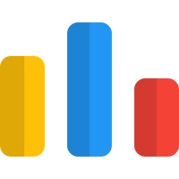

<h1 align="center">
  
</h1>

<h5 align="center">
  <code><a href="https://www.linkedin.com/in/mahedi-rigan-446786185/" title="LinkedIn Profile"> LinkedIn</a></code>
  <code><a href="https://codeforces.com/profile/Ganyu31" title="Codeforces Profile"> Codeforces</a></code>
</h5>
 

  Hi, I'm Md.Mahedi Hasan Rigan and I am a fourth year student of Computer Science and Engineering at <a href="https://www.buet.ac.bd/" title="BUET">Bangladesh University of Engineering and Technology</a>. I am a passionate learner who's always willing to learn and work across technologies and domains.
   
   
  <ul>
    <li>👨🏻‍💻  Most of my projects are available on <a href="https://github.com/Rigan31?tab=repositories" title="Github">Github</a> </li>
    <li>🌱 I’m currently learning Machine Learning and Web Development </li>
    <li>🎓 I graduated from Notre Dame College, Dhaka </li>
    <li>💻 I love writing code and learn anythings about it </li>
    <li>👯 In my free time, I love to watch movies, anime and play games like Valorant </li>
    <li>📫 How to reach me: <a href="mailto: mahedihasanrigan82@gmail.com">mahedihasanrigan82@gmail.com</a></li>
  </ul>
  Thanks for checking out my profile! Feel free to reach out if you have any questions or would like to collaborate on a project.

<h2 align="center">🔥 Languages & Frameworks & Tools & Abilities 🔥</h2>
 

  <code></code>
  <code></code>
  <code></code>
  <code></code>
  <code></code>
  <code></code>
  <code></code>
  <code></code>
  <code></code>
  <code></code>
  <code></code>
  <code></code>
  <code></code>
  <code></code>
  <code></code>
  <code></code>
  <code></code>
  <code></code>
  <code></code>
  <code></code>
  <code></code>

  
<ul>
  <li> <strong>Frontend:</strong> HTML, CSS, JavaScript, React, Bootstrap, Material UI, JQuery, JSON</li>
  <li> <strong>Backend:</strong> Node.js, Express.js, Django</li>
  <li> <strong>Database:</strong> PostgreSQL, MySQL, Oracle, Cassandra</li>
  <li> <strong>Tools:</strong> Git, GitHub, VS Code, Jupyter Notebook, Docker, Kubernetes</li>
</ul>

<h2 align="center">⚡ Stats ⚡</h2>
 

  

    
    
  

           
  

    
  

   
  
  

<h2 align="center">👨‍💻 Repositories 👨‍💻</h2>
 

  

      

  
  

      

<h4 align="center">
  <a href="https://github.com/Rigan31?tab=repositories" title="Show Repositories">🔎 Show More 🔍</a>
</h4>
